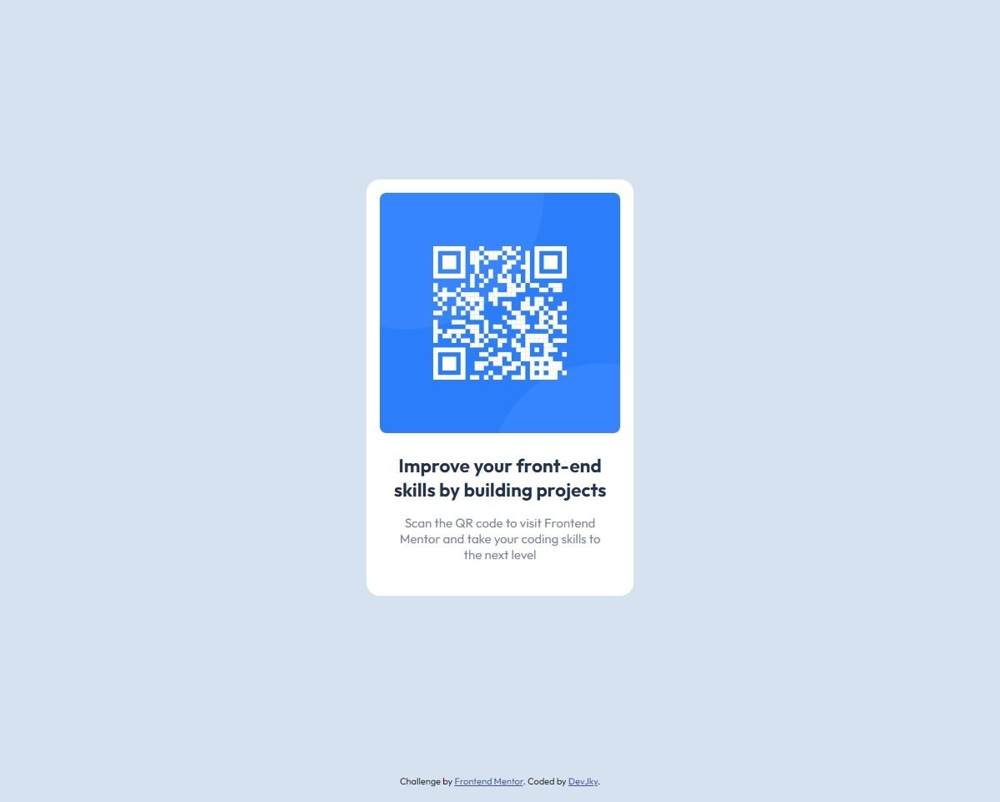

# Frontend Mentor - QR code component solution

This is a solution to the [QR code component challenge on Frontend Mentor](https://www.frontendmentor.io/challenges/qr-code-component-iux_sIO_H). Frontend Mentor challenges help you improve your coding skills by building realistic projects.

### Links

- [Solution URL](https://www.frontendmentor.io/solutions/qr-code-component-LVc15M08nN)
- [Live site URL](https://github.com/DevJky/frontendmentor-qr-code-component-challange)

### Built with

- Semantic HTML5 markup
- CSS Grid
